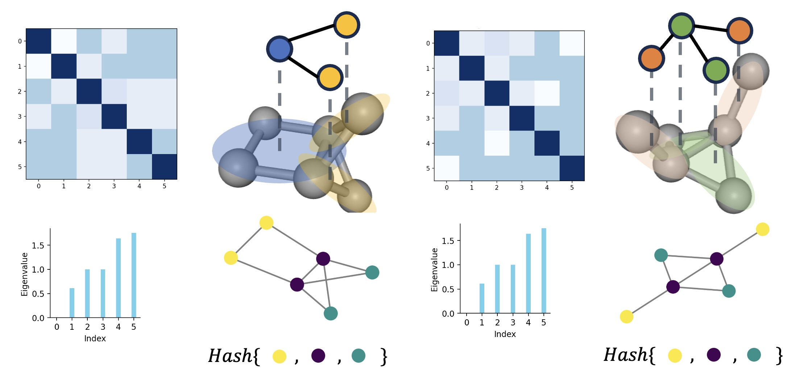
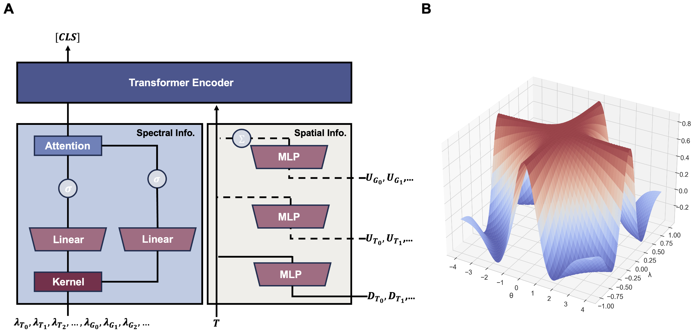
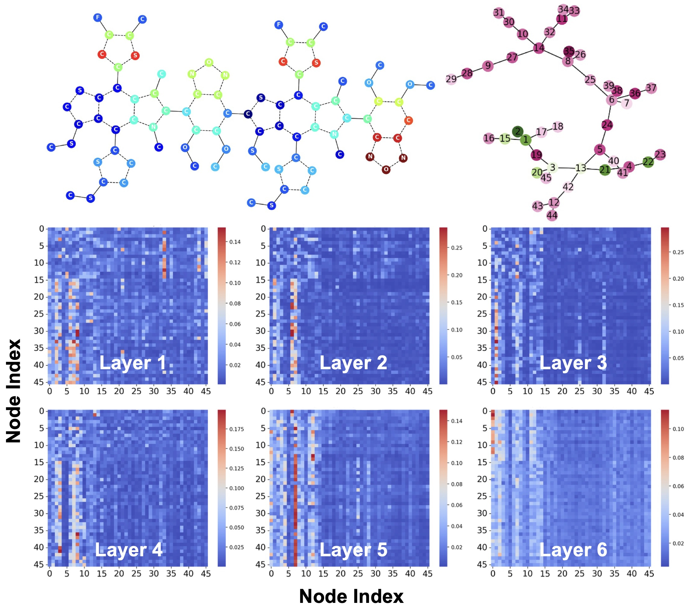

# SubFormer-Spec: SubGraph Transformer with the Spectral Token



## Abstract

Subgraph Transformer (SubFormer) takes the assumption that the molecules can be coarse-grained into a simpler representation, i.e., subgraphs. 
The subgraph representation is more interpretable and can be easily manipulated by the transformer.
Currently, the subgraph representation is obtained by using the Junction Tree decomposition of the molecule proposed in JT-VAE.
The SubFormer-Spec is a variant of SubFormer that uses the spectral token to capture the global information of the molecule.
The spectral token is a vector representation that is obtained by decomposing the graph Laplacian of the molecule to obtain the eigen spectrum.
The spectral token is then used as the global information of the molecule and is concatenated with the subgraph embeddings to form the input of the transformer.
The transformer is then used to predict the properties of the molecule.

## Intuition

The WL-inspired methods like Message-Passing are subject to the 1-WL limitation,
where the method is unable to distinguish between different molecules that have the same stable WL colors. 
In this case, the graph spectrum can be used to distinguish 1-WL undisguisable molecules.
Meanwhile, the graph spectrum is limited due to the graph cospectrality, 
which is the phenomenon where the eigenvalues of the graph Laplacian are the same for different graphs. However, such rare cases 
can be further remedied by using the coarse-grained subgraph representation, which is a priori for the SubFormer model.

## The Spectral Token



The direct utilization of the graph spectrum as the global information of the molecule is not pratical due to the graph 
cospectrality and the lack of interpretability and inductive bias. We propose to use Mexican Hat Wavelet to extract the frequency
information of the graph spectrum. The processed frequency information can be further enhanced by mixing the components and using 
the component-wise attention mechanism to capture the global information of the molecule. The processed frequency information is 
then used as the [CLS] token of the molecule, thus termed as the spectral token.

## Results
To date of April 2024, SubFormer-Spec ranks the 1st on the Peptides-Struct dataset from the LRGB benchmark, the 3rd on the Peptides-Function dataset.
And 5th on the ZINC dataset on PapersWithCode.

The SubFormer-Spec model is evaluated on the OGB, ZINC, and LRGB datasets. Part of results are shown in the following table:

| Dataset    | SubFormer-Spec Result | SubFormer-Spec Std | SubFormer Result | SubFormer Std |
|------------|-----------------------|--------------------|------------------|---------------|
| ZINC       | 0.068                 | 0.005              | 0.071            | 0.003         |
| Pep-Struct | 0.2441                | 0.011              | 0.2464           | 0.0012        |
| Pep-Func   | 0.7014                | 0.0086             | 0.6732           | 0.0045        |
| MUV        | 0.203                 | 0.012              | 0.182            | 0.019         |
| TOXCAST    | 0.764                 | 0.005              | 0.752            | 0.003         |


The results on the OPDA dataset are shown in the following table:

| Property     | E_HOMO-LUMO | Packing density | E_HOMO | E_LUMO | Dip. moment | Walltime(sec/epoch) |
|--------------|-------------|-----------------|--------|--------|-------------|-------------------|
| GCN          | 0.845       | 0.462           | 1.526  | 0.647  | 1.369       | 0.94              |
| GIN          | 0.210       | 0.073           | 0.273  | 0.557  | 1.236       | 0.91              |
| GATv2        | 0.299       | 0.069           | 1.357  | 0.445  | 1.548       | 1.04              |
| GraphGPS     | 0.080       | 0.015           | 0.068  | 0.044  | 0.966       | 1.92              |
| SchNet       | 0.331       | 0.215           | 0.429  | 0.297  | 1.236       | 1.58              |
| DimeNet++    | 0.139       | 0.026           | 0.190  | 0.093  | 1.089       | 3.97              |
| ClofNet      | 0.132       | 0.016           | 0.123  | 0.083  | 1.259       | 1.34              |
| EGNN         | 0.112       | 0.174           | 0.138  | 0.076  | 1.216       | 1.14              |
| SF           | 0.070       | 0.009           | 0.050  | 0.031  | 0.997       | 1.53              |
| SF-Spec      | **0.047**   | **0.008**       | **0.043** | **0.028** | **0.888** | 1.61              |


We also implement the Spectral Token to a GraphTrans model, which is an early graph transformer model. Comparing to the 
reported results on LRGB dataset, the GraphTrans-Spec model receives more than 10% improvements.

| Dataset  | GraphTrans         | GraphTrans-Spec         |
|----------|--------------------|-------------------------|
| Pep-Struct | 0.2777±0.0025      | **0.2487±0.0009**       |
| Pep-Func | 0.6313±0.0039      | **0.6957±0.0115**       |


## Requirements

- Python
- rdkit
- numpy
- scipy
- ogb
- tqdm
- struct
- torch-geometric
- torch-scatter
- PyTorch

## Usage

To run the experiments, you can use the following command, for example:

```bash
python scripts/pep-s.py
```

Datasets are handled by PyTorch Geometric and OGB. The datasets are automatically downloaded when you run the experiments.
Except for the OPDA dataset, which is provided in the `SubFormer/datasets` folder. Run the following command to download the OPDA dataset:

```bash
python scripts/opda.py
cp ./subformer/datasets/opda.db yourdatasetfolder/raw/opda.db
python scripts/opda.py
```

Under 'logs' folder, some configurations and results are provided for reference and as the starting point for tuning the model.

## Model Visualization on a OLED-like molecule

The following figure shows the visualization of the SubFormer model on a OLED-like molecule in the OPDA dataset. 
The self-attention weights are shown in the figure. 
The figure shows that the transformer is able to capture the local (functional groups) and global information (electron transfer) of the molecule.




## Citation

SubFormer architecture is proposed in the following paper:

```bibtex
@inproceedings{
pengmei2023transformers,
title={Transformers are efficient hierarchical chemical graph learners},
author={Zihan Pengmei and Zimu Li and Chih-chan Tien and Risi Kondor and Aaron Dinner},
booktitle={NeurIPS 2023 AI for Science Workshop},
year={2023},
url={https://openreview.net/forum?id=g0fOI1bE1C}
}
```
The Spectral token draft is in preparation. Please cite the above paper if you use the SubFormer-Spec model.

The OPDA dataset is accessed from https://cmr.fysik.dtu.dk/solar/solar.html. 

The citation of the following paper is also recommended for the coarsening method:

```bibtex
@inproceedings{jin2018junction,
  title={Junction tree variational autoencoder for molecular graph generation},
  author={Jin, Wengong and Barzilay, Regina and Jaakkola, Tommi},
  booktitle={International conference on machine learning},
  pages={2323--2332},
  year={2018},
  organization={PMLR}
}
@article{fey2020hierarchical,
  title={Hierarchical inter-message passing for learning on molecular graphs},
  author={Fey, Matthias and Yuen, Jan-Gin and Weichert, Frank},
  journal={arXiv preprint arXiv:2006.12179},
  year={2020}
}
```


## Contact

Please feel free to submit issue tickets or contact Zihan Pengmei (zpengmei@uchicago.edu) for any questions of using the code.
